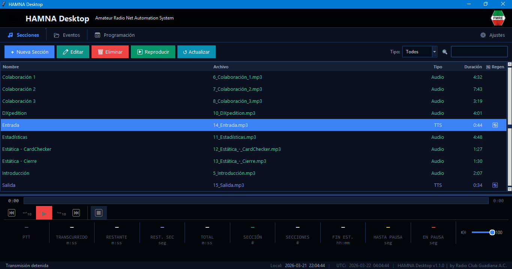
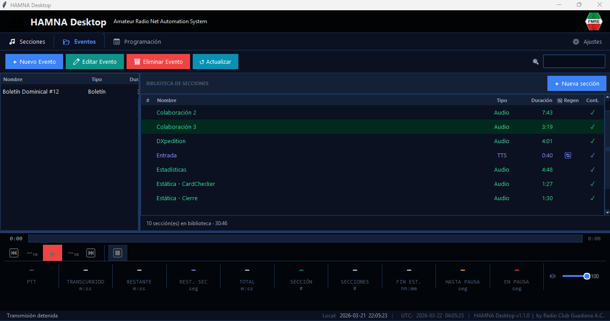
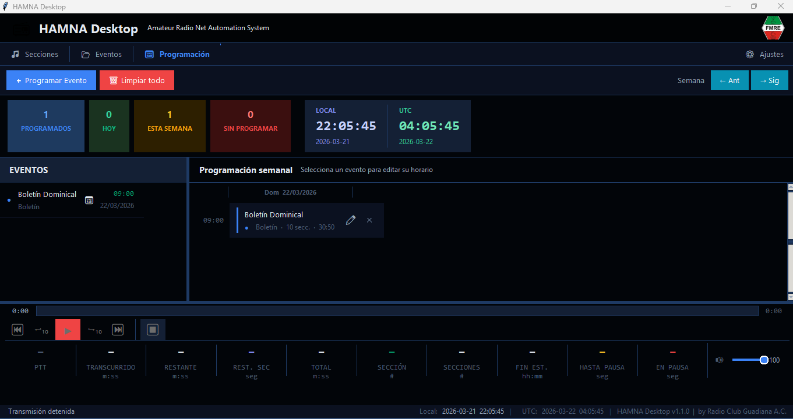
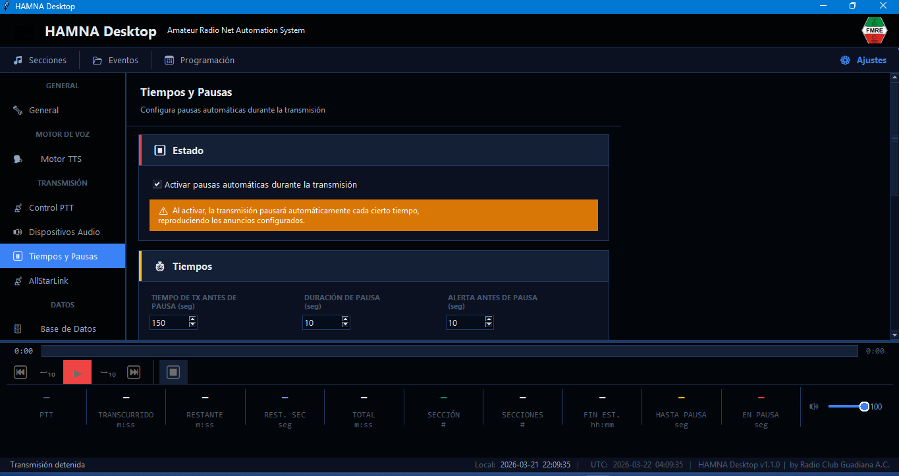

# HAMNA Desktop

Amateur Radio (HAM) Net Automation (NA) System — v1.1.0

Sistema de automatización para redes de radioaficionados. Permite programar y transmitir eventos de audio con control PTT, síntesis de voz (TTS), pausas automáticas y enlace a nodos AllStarLink.

---

## Capturas de pantalla

### Secciones
*Biblioteca reutilizable de unidades de audio — tipo TTS, Audio o Sonido. La barra inferior muestra el estado AL AIRE en tiempo real.*



---

### Eventos
*Agrupación de secciones en orden de transmisión. El panel lateral permite agregar secciones desde la biblioteca directamente.*



---

### Programación
*Agenda semanal con eventos programados. Muestra estado AL AIRE, hora local y UTC, y permite iniciar una transmisión manualmente con "Transmitir ahora".*



---

### Ajustes — Tiempos y Pausas
*Configuración de pausas automáticas, retroceso al reanudar y retardo PTT.*



---

## Requisitos

- **Windows 10/11**
- **Python 3.13** — [python.org/downloads](https://www.python.org/downloads/)
- `tkinter` incluido en Python estándar de Windows

---

## Instalación

```bat
:: 1. Clonar el repositorio
git clone https://github.com/xe2mbe/hamna_desktop.git
cd hamna_desktop

:: 2. Crear entorno virtual
python -m venv .venv
.venv\Scripts\activate

:: 3. Instalar dependencias
pip install -r requirements.txt

:: 4. Configurar ajustes
copy settings.json.example settings.json
:: Editar settings.json con tus valores (clave Azure, puerto serial, etc.)

:: 5. Ejecutar
python main.py
```

---

## Estructura del proyecto

```
hamna_desktop/
│
├── main.py                       <- Punto de entrada
├── main_window.py                <- Ventana principal + motor de transmisión
├── database.py                   <- Capa SQLite
├── settings.py                   <- Configuración JSON
├── ui_theme.py                   <- Tema oscuro/claro + widgets base
├── i18n.py                       <- Internacionalización (español)
│
├── modules/
│   ├── ptt/
│   │   ├── ptt_serial.py         <- PTT via RTS/DTR (pyserial)
│   │   ├── ptt_ami.py            <- PTT via Asterisk Manager Interface
│   │   ├── ptt_api.py            <- PTT via HTTP REST
│   │   └── ptt_manager.py        <- Fachada unificada PTT
│   ├── tts/
│   │   └── tts_manager.py        <- pyttsx3 + Azure TTS REST
│   ├── audio/
│   │   └── audio_player.py       <- Reproducción pygame + fallback MCI
│   └── asl/
│       └── asl_player.py         <- AllStarLink SFTP + AMI (rpt localplay)
│
├── views/
│   ├── np_bar.py                 <- Barra "AL AIRE" permanente
│   ├── view_secciones.py         <- Vista Secciones (biblioteca)
│   ├── view_eventos.py           <- Vista Eventos + secciones CRUD
│   ├── view_programacion.py      <- Vista Programación + timeline
│   └── view_ajustes.py           <- Vista Ajustes (TTS + PTT + Audio + ASL)
│
├── forms/
│   ├── evento_form.py            <- Modal Nuevo/Editar Evento
│   ├── seccion_form.py           <- Modal Sección (TTS / Audio / Sonido)
│   ├── prog_form.py              <- Modal Programar Evento
│   └── audio_player_window.py    <- Ventana de preescucha
│
├── docs/screenshots/             <- Capturas de pantalla del README
├── media/audios/                 <- Archivos de audio generados/importados
├── media/sonidos/                <- Audios de anuncios de pausa
├── hamna.db                      <- SQLite (se crea automáticamente)
├── settings.json                 <- Config local (NO se sube al repo)
├── settings.json.example         <- Plantilla de configuración
└── requirements.txt
```

---

## Funcionalidades

### Secciones (biblioteca reutilizable)

Unidades de audio independientes del evento:

| Tipo | Descripción |
|------|-------------|
| **TTS** | Texto con variables → Audio sintetizado al momento |
| **Audio** | Archivo .mp3 o .wav externo |
| **Sonido** | Clip corto .mp3/.wav (máx. 3 seg.) |

Las secciones TTS pueden marcarse como **Regenerar antes** (`🔄`): el audio se sintetiza automáticamente justo antes de reproducirse, reflejando siempre la hora y fecha actuales.

### Eventos

Agrupan secciones en orden para una transmisión:

- **Número de edición**: campo opcional para numerar ediciones del evento (ej. "Boletín Informativo #42"). El asistente calcula el número por ocurrencia del día de la semana en el año a partir de una fecha elegida.
- **Contabilizable**: cada sección del evento puede marcarse como contabilizable o no. Esto controla qué cuentan `{num_secciones}` y `{dur_contabilizable}`.

### Variables TTS

Disponibles en cualquier texto de sección tipo TTS:

| Variable | Descripción |
|----------|-------------|
| `{fecha}` | Fecha actual (dd/mm/aaaa) |
| `{hora}` | Hora actual (HH:MM) |
| `{dia}` | Día de la semana en español |
| `{pausa_cada}` | Intervalo de pausa configurado |
| `{pausa_duracion}` | Duración de la pausa configurada |
| `{pausa_alerta}` | Tiempo de alerta antes de pausa |
| `{evento}` | Nombre del evento de referencia |
| `{num_secciones}` | Cantidad de secciones contabilizables del evento |
| `{duracion_total}` | Duración total de todas las secciones del evento |
| `{dur_contabilizable}` | Duración de secciones contabilizables del evento |

---

## Ajustes

El panel de Ajustes se divide en siete secciones accesibles desde la barra lateral izquierda:

---

### General

Opciones globales de la aplicación:

- **Confirmar al cerrar**: muestra un diálogo de confirmación si hay una transmisión activa al intentar cerrar la app.
- **Idioma**: español / English.

---

### Motor TTS

Configura el sintetizador de voz:

**pyttsx3 (offline)**
- Motor local sin conexión a internet, usa voces SAPI5 instaladas en Windows.
- Selección de voz, velocidad (palabras por minuto) y volumen.
- Botón de prueba con texto personalizable.

> Para agregar voces en español: `Configuración → Hora e idioma → Voz → Agregar voces`

**Azure Cognitive Services (voces neuronales)**
- Integración vía REST API — no requiere SDK adicional.
- Campos: Clave de suscripción, Región, Voz, Estilo de voz, Tasa de habla y Tono.
- Selector de formato de salida (MP3 128 kbps, 192 kbps, WAV, etc.).
- Botón de prueba que genera y reproduce el audio directamente.

> Para activar Azure: crear un recurso "Speech" en [portal.azure.com](https://portal.azure.com), copiar la clave y la región.

---

### Control PTT

Gestiona los tres métodos de Push-to-Talk disponibles simultáneamente. Cada método tiene su propio botón de activación independiente. Todos los métodos habilitados reciben PTT ON/OFF al mismo tiempo. Al cerrar la app se envía PTT OFF a todos sin importar cuáles estén activos.

**Serial RS-232 (RTS / DTR)**
- Puerto COM, baudrate y pin (RTS o DTR).
- Requiere driver USB-Serial instalado (CH340, CP2102, etc.).

```
Ajustes → Control PTT → Serial RS-232
Puerto: COM3   Baudrate: 9600   Pin: RTS
```

**AMI — Asterisk Manager Interface**
- Host, puerto (por defecto 5038), usuario y contraseña.
- Contexto y extensiones PTT ON/OFF configurables en `extensions.conf`.

```
Ajustes → Control PTT → AMI
Host: 127.0.0.1  Port: 5038
Usuario/Contraseña: credenciales de manager.conf
```

**En Asterisk (`extensions.conf`):**
```
[ptt-control]
exten => ptt-on,1,NoOp(PTT ON)
exten => ptt-on,2,UserEvent(PTT,Status: ON)
exten => ptt-on,3,Hangup()

exten => ptt-off,1,NoOp(PTT OFF)
exten => ptt-off,2,UserEvent(PTT,Status: OFF)
exten => ptt-off,3,Hangup()
```

**HTTP API**
- URL base, ruta ON y ruta OFF.
- Método HTTP (GET / POST / PUT) y cabeceras opcionales.
- Útil para integrar con hardware de radio controlado por red.

```
Ajustes → Control PTT → API HTTP
URL Base: http://192.168.1.37   Ruta ON: /ptt_on   Ruta OFF: /ptt_off
```

---

### Dispositivos Audio

- Selección del dispositivo de salida de audio principal.
- Volumen de monitoreo independiente del nivel del sistema.

---

### Tiempos y Pausas

Controla el ciclo de pausa automática durante transmisiones largas:

| Parámetro | Descripción |
|-----------|-------------|
| **Tiempo de TX antes de pausa** | Segundos continuos de transmisión antes de pausar automáticamente (10–3600 s) |
| **Duración de pausa** | Tiempo de silencio entre el anuncio de pausa y el anuncio de regreso (5–600 s) |
| **Alerta antes de pausa** | Segundos de antelación para reproducir el audio de alerta (0–60 s) |
| **Retardo PTT ON** | Silencio entre PTT ON y el inicio del audio; compensa la latencia del transmisor (0–10 s) |
| **Retroceso al reanudar** | Al regresar de una pausa automática, retrocede N segundos antes de la posición guardada para que los oyentes no pierdan contexto (1–20 s, activable independientemente) |

**Archivos de audio** asociados a la secuencia de pausa:

| Audio | Momento de reproducción |
|-------|------------------------|
| 🔔 **Alerta de pausa** | N segundos antes del corte, con PTT ON |
| ⏸ **Anuncio de pausa** | Al pausar; PTT permanece ON durante este audio |
| ▶ **Anuncio de continuamos** | Al reanudar, antes de volver al evento |

---

### AllStarLink

Transmite el audio del evento a un nodo AllStarLink (ASL) en paralelo con la reproducción local, sin interrumpir el flujo normal de la transmisión.

| Campo | Descripción |
|-------|-------------|
| **Nodo ASL** | Número de nodo destino (ej. 299080) |
| **SFTP Host / Puerto / Usuario / Contraseña** | Acceso SSH al Raspberry Pi con AllStarLink OS |
| **Ruta remota** | Directorio en el Pi donde se sube el audio (por defecto `/tmp/hamna`) |
| **AMI Host / Puerto / Usuario / Contraseña** | Acceso al Asterisk Manager Interface del nodo |

El audio se convierte automáticamente a WAV 8 kHz 16-bit mono (formato nativo de Asterisk), se sube por SFTP y se ejecuta `rpt localplay` vía AMI — el nodo controla el PTT del transmisor automáticamente.

Incluye tres botones de prueba independientes: **Test SFTP**, **Test AMI** y **Test localplay**.

> Requiere port forwarding para SSH (22) y AMI (5038) hacia el Raspberry Pi.

---

### Base de Datos

- Ruta del archivo `hamna.db` y carpeta de audios.
- **Explorador de tablas**: visualiza el contenido de cualquiera de las tablas directamente desde la interfaz (eventos, secciones, evento_secciones, programacion, tipos_seccion, eventos_type).
- Botón de respaldo para copiar `hamna.db` a una ubicación elegida.

---

## Motor de transmisión

El motor central (`main_window.py`) orquesta el ciclo completo de un evento:

```
PTT ON → [retardo PTT] → Sección 1 → [gap] → PTT ON → Sección 2 → ... → PTT OFF
                                ↓ (pausa automática)
                         Anuncio de pausa → PTT OFF → [espera] → PTT ON → Anuncio de regreso
                                ↓ (retroceso opcional)
                         Reanudar sección desde posición guardada − N segundos
```

- Las secciones TTS con **Regenerar antes** se sintetizan en un hilo de fondo; el timer se suspende durante la generación para evitar avances prematuros.
- El reproductor local y el nodo ASL corren en paralelo.
- PTT OFF de seguridad a todos los métodos al cerrar la aplicación.

---

## Empaquetado como .exe

```powershell
pip install pyinstaller
pyinstaller --onefile --windowed --name "HAMNA Desktop" --add-data "media:media" main.py
# El ejecutable queda en dist\HAMNA Desktop.exe
```

---

## Notas

- `settings.json` **no se incluye en el repositorio** — usar `settings.json.example` como plantilla
- La base de datos `hamna.db` se crea automáticamente en el primer inicio
- El log completo se guarda en `hamna.log`
